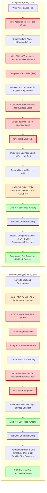

```mermaid
flowchart TD
subgraph Acceptance_Test_Cycle
A1["Write Acceptance Test"]
A2["First Acceptance Test Fails (Red)"]:::red
A3["Start Thinking About UI/Frontend Code"]
A4["Write Widget/Component Test for Initial UI Element"]:::red
A5["Component Test Fails (Red)"]:::red
A6["Write Dumb Component for Initial UI Requirement"]
A7["Component Test Still Fails (No Business Logic)"]:::red
A8["Write First Unit Test for Business Logic"]:::red
A9["Unit Test Fails (Red)"]:::red
A10["Implement Business Logic to Pass Unit Test"]
A11["Design Backend Service API"]
A12["If API Call Exists, Write Consumer-Driven Contract (CDC) Test"]:::cdc
A13["Unit Test Succeeds (Green)"]:::green
A14["Refactor Code (Refactor)"]:::refactor
A15["Repeat Component & Unit Test Cycle Until Acceptance Criteria Met"]
A16["Acceptance Test Succeeds with Mock Backend"]:::green
end

    subgraph Backend_Development_Cycle
        B1["Move to Backend Development"]
        B2["Write CDC Provider Test for Frontend Contract"]:::cdc
        B3["CDC Provider Test Fails (Red)"]:::red
        B4["Write Integration Test"]:::red
        B5["Integration Test Fails (Red)"]:::red
        B6["Create Resource Routing"]
        B7["Write First Unit Test for Backend Business Logic"]:::red
        B8["Unit Test Fails (Red)"]:::red
        B9["Implement Business Logic to Pass Unit Test"]
        B10["Unit Test Succeeds (Green)"]:::green
        B11["Refactor Code (Refactor)"]:::refactor
        B12["Repeat Integration & Unit Test Cycle Until CDC Provider Test Succeeds"]
        B13["CDC Provider Test Succeeds (Green)"]:::green
    end

    %% Connecting the steps in the Acceptance_Test_Cycle
    A1 --> A2 --> A3 --> A4 --> A5 --> A6 --> A7 --> A8 --> A9 --> A10 --> A11 --> A12 --> A13 --> A14 --> A15 --> A16

    %% Connecting the steps in the Backend_Development_Cycle
    B1 --> B2 --> B3 --> B4 --> B5 --> B6 --> B7 --> B8 --> B9 --> B10 --> B11 --> B12 --> B13

    %% Linking Acceptance_Test_Cycle to Backend_Development_Cycle
    A16 --> B1

    %% Styling for color-coded phases
    classDef red fill:#ffcccc,stroke:#cc0000,stroke-width:2px;
    classDef green fill:#ccffcc,stroke:#00cc00,stroke-width:2px;
    classDef refactor fill:#e6e6ff,stroke:#3333cc,stroke-width:2px;
    classDef cdc fill:#ffebcc,stroke:#ff9933,stroke-width:2px;

    %% Applying styles to nodes
    class A2,A5,A7,A9,B3,B5,B8 red;
    class A13,A16,B10,B13 green;
    class A14,B11 refactor;
    class A12,B2 cdc;
```
