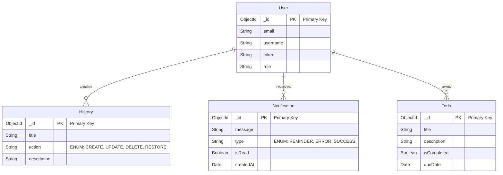

### Collections

#### 1. Users

-   **Description**: This collection stores user information for authentication and role management.
-   **Schema**:
    ```javascript
    {
        _id: ObjectId,         // Unique identifier generated by MongoDB
        email: String,        // User's email address
        username: String,     // User's username
        token: String,        // JWT token for authentication
        role: String          // Role of the user (e.g., admin, user)
    }
    ```

#### 2. Histories

-   **Description**: This collection keeps a record of actions performed by users.
-   **Schema**:

    ```javascript
    {
        _id: ObjectId,         // Unique identifier generated by MongoDB
        title: String,        // Title of the history action
        action: String,       // Action type (CREATE, UPDATE, DELETE, RESTORE)
        description: String    // Description of the action
    }
    ```

-   **Enum**: `ActionType`
    -   **Values**:
        -   `"create"`
        -   `"update"`
        -   `"delete"`
        -   `"restore"`

#### 3. Notifications

-   **Description**: This collection contains notifications sent to users.
-   **Schema**:

    ```javascript
    {
        _id: ObjectId,          // Unique identifier generated by MongoDB
        message: String,        // Content of the notification
        type: String,           // Type of notification (REMINDER, ERROR, SUCCESS)
        isRead: Boolean,        // Read status of the notification
        createdAt: Date         // Timestamp of when the notification was created
    }
    ```

-   **Enum**: `NotificationType`
    -   **Values**:
        -   `"reminder"`
        -   `"error"`
        -   `"success"`

#### 4. Todos

-   **Description**: This collection holds user-defined to-do items.
-   **Schema**:
    ```javascript
    {
        _id: ObjectId,         // Unique identifier generated by MongoDB
        title: String,        // Title of the to-do item
        description: String,   // Description of the to-do item
        isCompleted: Boolean,  // Completion status of the to-do item
        dueDate: Date          // Due date for the to-do item
    }
    ```

---

## Mermaid Database Model

Here is a visual representation of the database model using Mermaid syntax:



### Notes

-   Each collection uses `_id` as the primary key, which is automatically generated by MongoDB.
-   Enums are represented in the documentation to indicate the possible values for `action` in the `History` collection and `type` in the `Notification` collection.
-   Relationships indicate how users interact with the other entities in the database.
