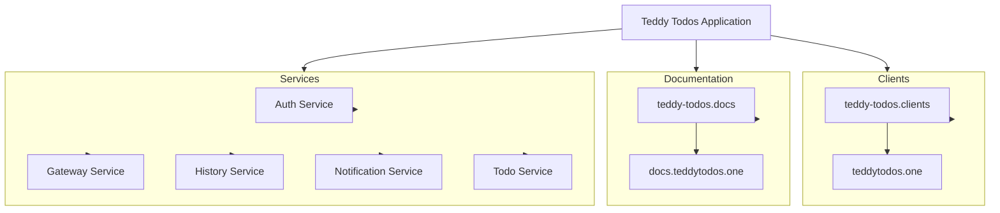

### Project Structure

The project is organized as follows:

```
.
├── k8s
│   └── teddy-todos.clients          # Kubernetes configurations for client services
├── teddy-todos.clients               # Client application source code
│   └── teddytodos.one                # Main client folder
│       ├── README.md                 # Documentation for the client
│       ├── node_modules              # Node.js modules for client
│       ├── package-lock.json         # Lock file for npm dependencies
│       ├── package.json              # Package configuration for client
│       ├── postcss.config.js         # Configuration for PostCSS
│       ├── public                    # Public assets for the client
│       ├── scripts                   # Custom scripts for client
│       ├── src                       # Source code for client components
│       ├── tailwind.config.js        # Configuration for Tailwind CSS
│       └── tsconfig.json             # TypeScript configuration for client
├── teddy-todos.docs                  # Documentation source code
│   └── docs.teddytodos.one           # Main documentation folder
│       ├── docs                      # Directory for documentation content
│       ├── docusaurus.config.ts      # Configuration for Docusaurus
│       ├── node_modules              # Node.js modules for docs
│       ├── package-lock.json         # Lock file for documentation dependencies
│       ├── package.json              # Package configuration for documentation
│       ├── sidebars.ts               # Sidebar configuration for documentation
│       ├── src                       # Source code for documentation
│       ├── static                    # Static assets for documentation
│       └── tsconfig.json             # TypeScript configuration for docs
└── teddy-todos.services               # Backend service source code
    ├── auth                          # Authentication service
    │   ├── cmd                       # Command-line interface (CLI) for auth service
    │   ├── go.mod                    # Go module file for auth service
    │   └── internal                  # Internal logic for auth service
    ├── gateway                        # API Gateway service
    │   ├── cmd                       # Command-line interface (CLI) for gateway service
    │   └── internal                  # Internal logic for gateway service
    ├── history                        # History service
    │   ├── cmd                       # Command-line interface (CLI) for history service
    │   ├── go.mod                    # Go module file for history service
    │   └── internal                  # Internal logic for history service
    ├── notification                   # Notification service
    │   ├── cmd                       # Command-line interface (CLI) for notification service
    │   ├── go.mod                    # Go module file for notification service
    │   └── internal                  # Internal logic for notification service
    └── todo                           # To-Do service
        ├── cmd                       # Command-line interface (CLI) for todo service
        ├── go.mod                    # Go module file for todo service
        └── internal                  # Internal logic for todo service
```

### Components

-   **Kubernetes Configurations**: Located in the `k8s` directory, this includes configurations for deploying the client services in a Kubernetes cluster.
-   **Client Applications**: The `teddy-todos.clients` directory contains the main client application, structured using modern frontend technologies. The main client is housed in `teddytodos.one`, which includes configuration files, public assets, source code, and build tools.

-   **Documentation**: The `teddy-todos.docs` directory is structured for creating documentation using Docusaurus. This includes configuration files, source code for documentation content, and static assets.

-   **Backend Services**: The `teddy-todos.services` directory contains multiple services:
    -   **Auth Service**: Handles user authentication and authorization.
    -   **Gateway Service**: Acts as an API gateway, routing requests to the appropriate backend services.
    -   **History Service**: Manages the action history of users.
    -   **Notification Service**: Manages notifications for users.
    -   **Todo Service**: Manages to-do items for users.

---

## Mermaid System Architecture Diagram

Here’s a visual representation of the system architecture using Mermaid syntax:



### Notes

-   The **Teddy Todos Application** is the overarching system that integrates client applications, documentation, and various backend services.
-   The architecture highlights the modularity of the application, allowing for scalable and maintainable components.
